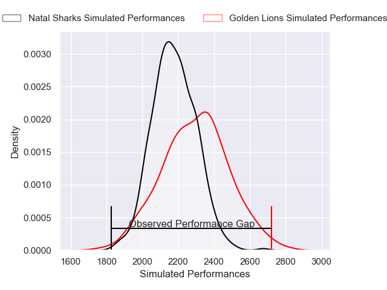
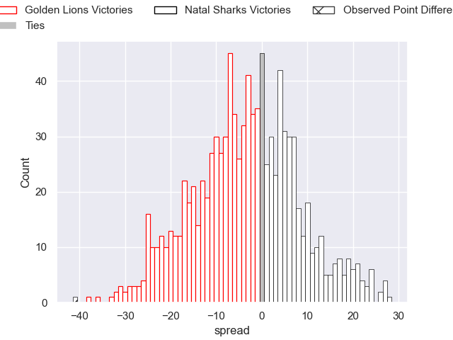
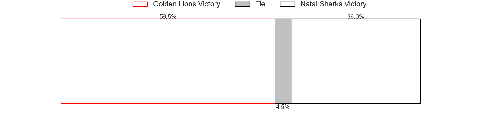

---  
layout: page  
title: Golden Lions V Natal Sharks on 2025/07/26  
date: 2025-07-26  
categories: "Currie Cup 2025" match projection  
---
# Golden Lions V Natal Sharks on 2025/07/26, 46.0 to 5.0

# Club Level Predictions

Now that the game has been played, lets see how the club predictions did. I predicted Golden Lions to win by 3.22, and Golden Lions won by 41.0. That's an absolute error of 37.8 for the margin of victory, while my average absolute error has been 14.2 over the past six months. This prediction was more accurate than 5.6% of my recent predictions.

For the Over/Under model, I predicted a total of 57.5 and we have an actual total of 51.0. That's an absolute error of 6.5 compared to a six month average of 13.9. This prediction was more accurate than 71.8% of my recent predictions.
## Projected Performances - Club Model

## Projected Spreads - Club Model

## Projected Results - Club Model

