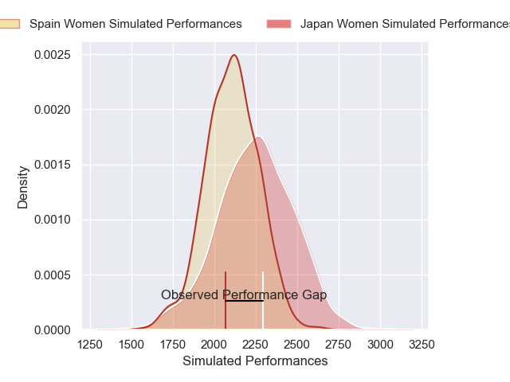
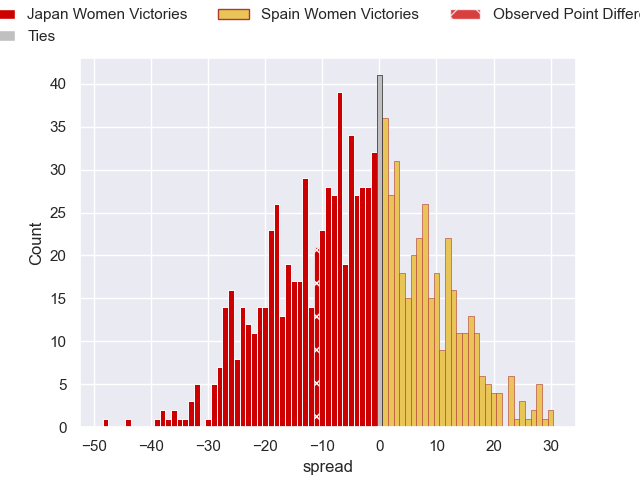

---  
layout: page  
title: Japan Women V Spain Women on 2025/07/26  
date: 2025-07-26  
categories: "Women's International Test Match 2025" match projection  
---
# Japan Women V Spain Women on 2025/07/26, 30.0 to 19.0

# Club Level Predictions

Now that the game has been played, lets see how the club predictions did. I predicted Japan Women to win by 4.35, and Japan Women won by 11.0. That's an absolute error of 6.6 for the margin of victory, while my average absolute error has been 14.2 over the past six months. This prediction was more accurate than 68.2% of my recent predictions.

For the Over/Under model, I predicted a total of 54.5 and we have an actual total of 49.0. That's an absolute error of 5.5 compared to a six month average of 14.1. This prediction was more accurate than 75.9% of my recent predictions.
## Projected Performances - Club Model

## Projected Spreads - Club Model

## Projected Results - Club Model

