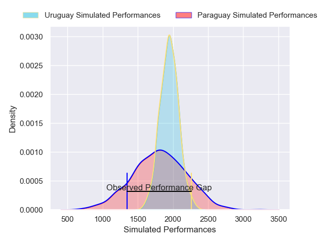
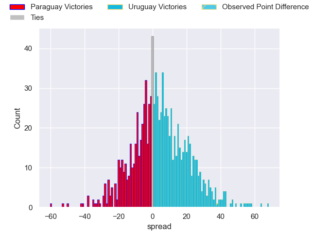

---  
layout: page  
title: Paraguay V Uruguay on 2025/07/26  
date: 2025-07-26  
categories: "International Test Match 2025" match projection  
---
# Paraguay V Uruguay on 2025/07/26, 0.0 to 38.0

# Club Level Predictions

Now that the game has been played, lets see how the club predictions did. I predicted Uruguay to win by 3.74, and Uruguay won by 38.0. That's an absolute error of 34.3 for the margin of victory, while my average absolute error has been 14.2 over the past six months. This prediction was more accurate than 6.9% of my recent predictions.

For the Over/Under model, I predicted a total of 54.5 and we have an actual total of 38.0. That's an absolute error of 16.5 compared to a six month average of 13.9. This prediction was more accurate than 32.7% of my recent predictions.
## Projected Performances - Club Model

## Projected Spreads - Club Model

## Projected Results - Club Model

