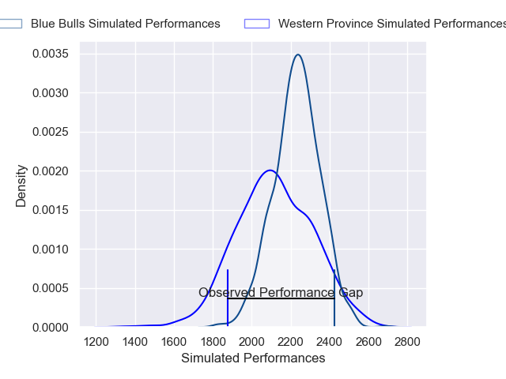
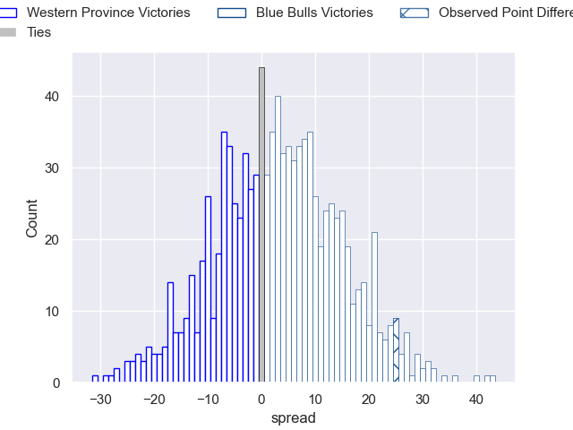

---  
layout: page  
title: Western Province V Blue Bulls on 2025/07/26  
date: 2025-07-26  
categories: "Currie Cup 2025" match projection  
---
# Western Province V Blue Bulls on 2025/07/26, 23.0 to 48.0

# Club Level Predictions

Now that the game has been played, lets see how the club predictions did. I predicted Blue Bulls to win by 3.33, and Blue Bulls won by 25.0. That's an absolute error of 21.7 for the margin of victory, while my average absolute error has been 14.2 over the past six months. This prediction was more accurate than 20.4% of my recent predictions.

For the Over/Under model, I predicted a total of 60.5 and we have an actual total of 71.0. That's an absolute error of 10.5 compared to a six month average of 14.1. This prediction was more accurate than 53.7% of my recent predictions.
## Projected Performances - Club Model

## Projected Spreads - Club Model

## Projected Results - Club Model

