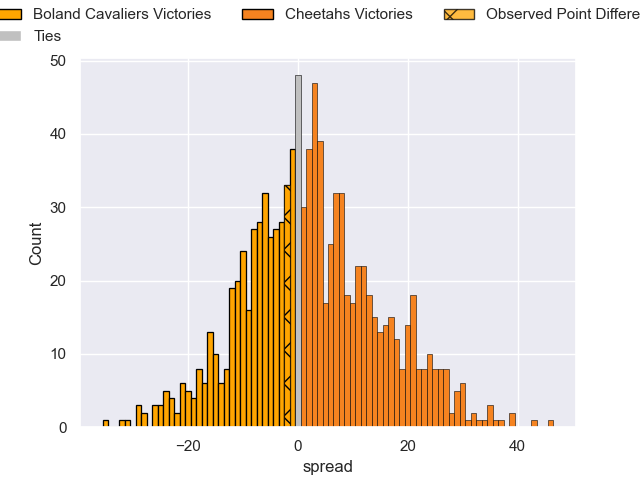

---  
layout: page  
title: Boland Cavaliers V Cheetahs on 2025/07/27  
date: 2025-07-27  
categories: "Currie Cup 2025" match projection  
---
# Boland Cavaliers V Cheetahs on 2025/07/27, 37.0 to 35.0

# Club Level Predictions

Now that the game has been played, lets see how the club predictions did. I predicted Cheetahs to win by 2.61, and Boland Cavaliers won by 2.0. That's an absolute error of 4.6 for the margin of victory, while my average absolute error has been 14.2 over the past six months. This prediction was more accurate than 77.4% of my recent predictions.

For the Over/Under model, I predicted a total of 55.5 and we have an actual total of 72.0. That's an absolute error of 16.5 compared to a six month average of 14.1. This prediction was more accurate than 33.8% of my recent predictions.
## Projected Performances - Club Model

## Projected Spreads - Club Model

## Projected Results - Club Model

