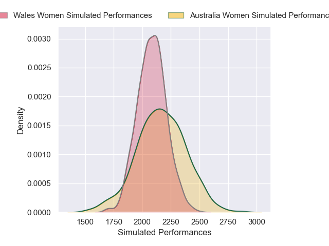
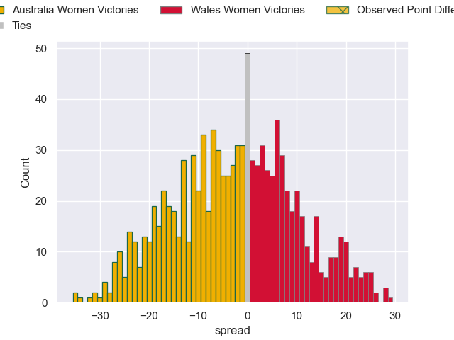

---  
layout: page  
title: Australia Women V Wales Women on 2025/08/01  
date: 2025-08-01  
categories: "Women's International Test Match 2025" match projection  
---
# Australia Women V Wales Women on 2025/08/01, 36.0 to 5.0

# Club Level Predictions

Now that the game has been played, lets see how the club predictions did. I predicted Australia Women to win by 2.44, and Australia Women won by 31.0. That's an absolute error of 28.6 for the margin of victory, while my average absolute error has been 14.2 over the past six months. This prediction was more accurate than 10.8% of my recent predictions.

For the Over/Under model, I predicted a total of 49.5 and we have an actual total of 41.0. That's an absolute error of 8.5 compared to a six month average of 14.1. This prediction was more accurate than 62.1% of my recent predictions.
## Projected Performances - Club Model

## Projected Spreads - Club Model

## Projected Results - Club Model

