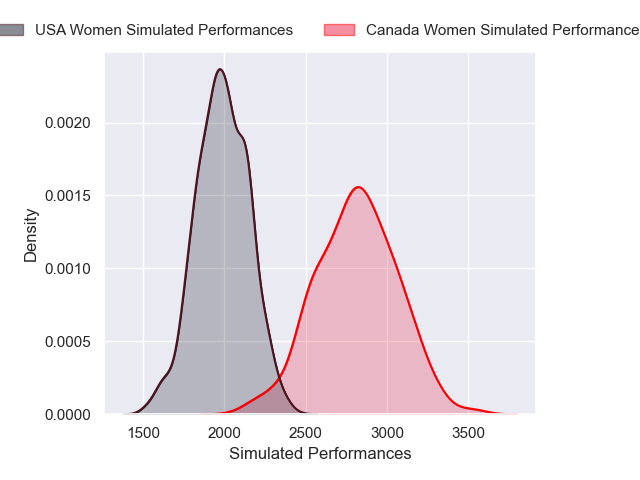

---  
layout: page  
title: Canada Women V USA Women on 2025/08/01  
date: 2025-08-01  
categories: "Women's International Test Match 2025" match projection  
---
# Canada Women V USA Women on 2025/08/01, 42.0 to 10.0

# Club Level Predictions

Now that the game has been played, lets see how the club predictions did. I predicted Canada Women to win by 21.67, and Canada Women won by 32.0. That's an absolute error of 10.3 for the margin of victory, while my average absolute error has been 14.2 over the past six months. This prediction was more accurate than 50.9% of my recent predictions.

For the Over/Under model, I predicted a total of 61.5 and we have an actual total of 52.0. That's an absolute error of 9.5 compared to a six month average of 14.1. This prediction was more accurate than 58.3% of my recent predictions.
## Projected Performances - Club Model

## Projected Spreads - Club Model

## Projected Results - Club Model

