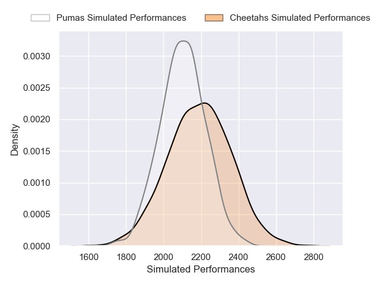
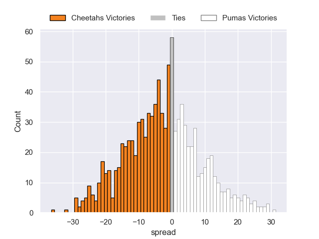

---  
layout: page  
title: Cheetahs V Pumas on 2025/08/01  
date: 2025-08-01  
categories: "Currie Cup 2025" match projection  
---
# Cheetahs V Pumas on 2025/08/01, 42.0 to 25.0

# Club Level Predictions

Now that the game has been played, lets see how the club predictions did. I predicted Cheetahs to win by 3.2, and Cheetahs won by 17.0. That's an absolute error of 13.8 for the margin of victory, while my average absolute error has been 14.2 over the past six months. This prediction was more accurate than 38.9% of my recent predictions.

For the Over/Under model, I predicted a total of 60.5 and we have an actual total of 67.0. That's an absolute error of 6.5 compared to a six month average of 14.0. This prediction was more accurate than 71.5% of my recent predictions.
## Projected Performances - Club Model

## Projected Spreads - Club Model

## Projected Results - Club Model

