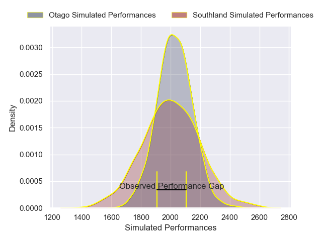
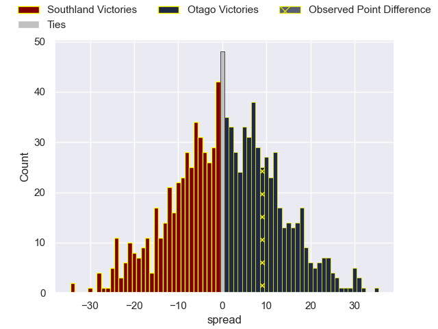

---  
layout: page  
title: Southland V Otago on 2025/08/01  
date: 2025-08-01  
categories: "NPC 2025" match projection  
---
# Southland V Otago on 2025/08/01, 15.0 to 24.0

# Club Level Predictions

Now that the game has been played, lets see how the club predictions did. I predicted Otago to win by 0.74, and Otago won by 9.0. That's an absolute error of 8.3 for the margin of victory, while my average absolute error has been 14.2 over the past six months. This prediction was more accurate than 59.8% of my recent predictions.

For the Over/Under model, I predicted a total of 57.5 and we have an actual total of 39.0. That's an absolute error of 18.5 compared to a six month average of 14.0. This prediction was more accurate than 28.8% of my recent predictions.
## Projected Performances - Club Model

## Projected Spreads - Club Model

## Projected Results - Club Model

