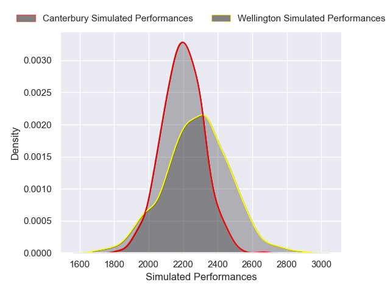
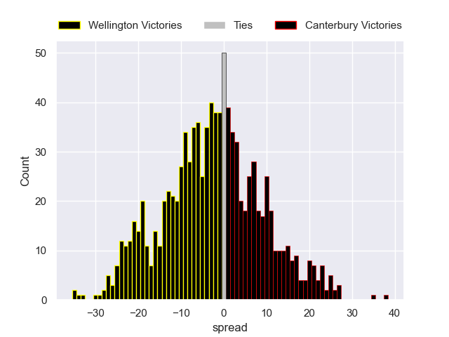

---  
layout: page  
title: Wellington V Canterbury on 2025/08/01  
date: 2025-08-01  
categories: "NPC 2025" match projection  
---
# Wellington V Canterbury on 2025/08/01, 15.0 to 33.0

# Club Level Predictions

Now that the game has been played, lets see how the club predictions did. I predicted Wellington to win by 1.76, and Canterbury won by 18.0. That's an absolute error of 19.8 for the margin of victory, while my average absolute error has been 14.2 over the past six months. This prediction was more accurate than 24.3% of my recent predictions.

For the Over/Under model, I predicted a total of 57.5 and we have an actual total of 48.0. That's an absolute error of 9.5 compared to a six month average of 14.0. This prediction was more accurate than 58.1% of my recent predictions.
## Projected Performances - Club Model

## Projected Spreads - Club Model

## Projected Results - Club Model

