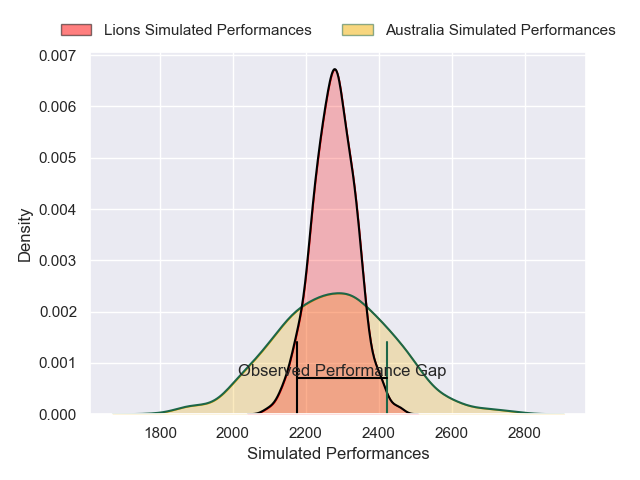
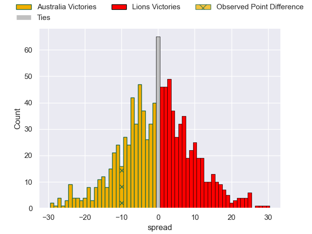

---  
layout: page  
title: Australia V Lions on 2025/08/02  
date: 2025-08-02  
categories: "International Test Match 2025" match projection  
---
# Australia V Lions on 2025/08/02, 22.0 to 12.0

# Club Level Predictions

Now that the game has been played, lets see how the club predictions did. I predicted Lions to win by 0.14, and Australia won by 10.0. That's an absolute error of 10.1 for the margin of victory, while my average absolute error has been 14.2 over the past six months. This prediction was more accurate than 52.1% of my recent predictions.

For the Over/Under model, I predicted a total of 50.5 and we have an actual total of 34.0. That's an absolute error of 16.5 compared to a six month average of 14.0. This prediction was more accurate than 33.8% of my recent predictions.
## Projected Performances - Club Model

## Projected Spreads - Club Model

## Projected Results - Club Model

