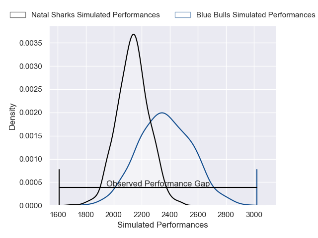
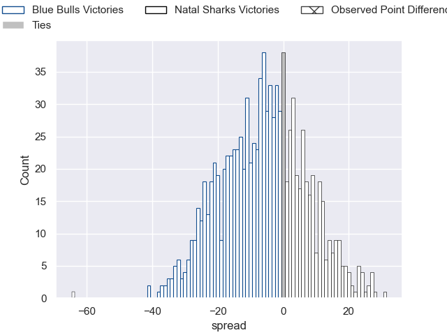

---  
layout: page  
title: Blue Bulls V Natal Sharks on 2025/08/02  
date: 2025-08-02  
categories: "Currie Cup 2025" match projection  
---
# Blue Bulls V Natal Sharks on 2025/08/02, 64.0 to 0.0

# Club Level Predictions

Now that the game has been played, lets see how the club predictions did. I predicted Blue Bulls to win by 6.29, and Blue Bulls won by 64.0. That's an absolute error of 57.7 for the margin of victory, while my average absolute error has been 14.2 over the past six months. This prediction was more accurate than 1.3% of my recent predictions.

For the Over/Under model, I predicted a total of 59.5 and we have an actual total of 64.0. That's an absolute error of 4.5 compared to a six month average of 14.0. This prediction was more accurate than 81.0% of my recent predictions.
## Projected Performances - Club Model

## Projected Spreads - Club Model

## Projected Results - Club Model

