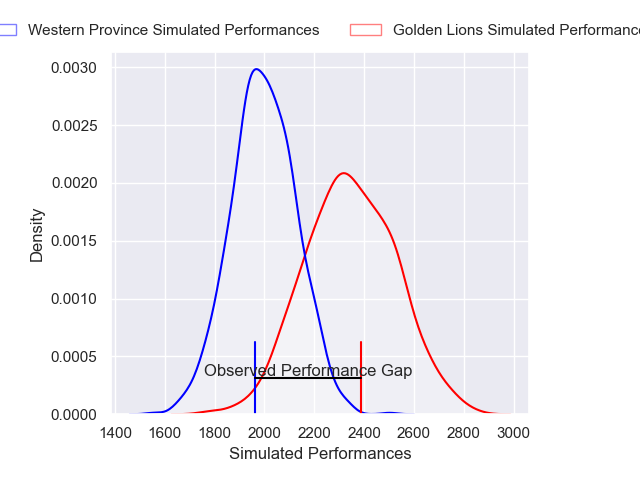
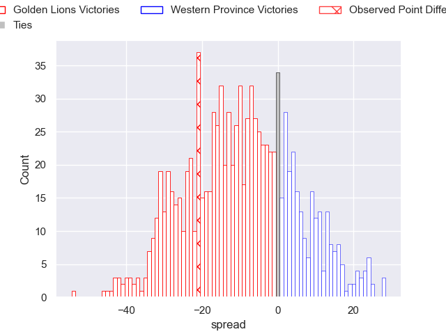

---  
layout: page  
title: Golden Lions V Western Province on 2025/08/02  
date: 2025-08-02  
categories: "Currie Cup 2025" match projection  
---
# Golden Lions V Western Province on 2025/08/02, 40.0 to 19.0

# Club Level Predictions

Now that the game has been played, lets see how the club predictions did. I predicted Golden Lions to win by 9.41, and Golden Lions won by 21.0. That's an absolute error of 11.6 for the margin of victory, while my average absolute error has been 14.2 over the past six months. This prediction was more accurate than 46.8% of my recent predictions.

For the Over/Under model, I predicted a total of 58.5 and we have an actual total of 59.0. That's an absolute error of 0.5 compared to a six month average of 14.1. This prediction was more accurate than 97.0% of my recent predictions.
## Projected Performances - Club Model

## Projected Spreads - Club Model

## Projected Results - Club Model

