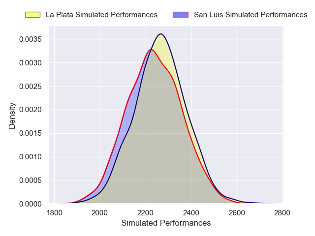
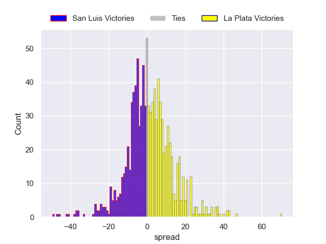

---  
layout: page  
title: San Luis V La Plata on 2025/08/02  
date: 2025-08-02  
categories: "URBA Top 13 2025" match projection  
---
# San Luis V La Plata on 2025/08/02, 31.0 to 11.0

# Club Level Predictions

Now that the game has been played, lets see how the club predictions did. I predicted San Luis to win by 0.78, and San Luis won by 20.0. That's an absolute error of 19.2 for the margin of victory, while my average absolute error has been 14.2 over the past six months. This prediction was more accurate than 25.7% of my recent predictions.

For the Over/Under model, I predicted a total of 51.5 and we have an actual total of 42.0. That's an absolute error of 9.5 compared to a six month average of 14.1. This prediction was more accurate than 58.3% of my recent predictions.
## Projected Performances - Club Model

## Projected Spreads - Club Model

## Projected Results - Club Model

