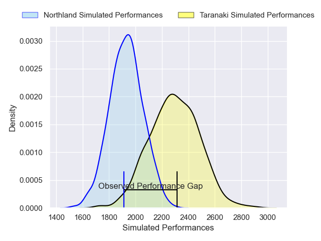
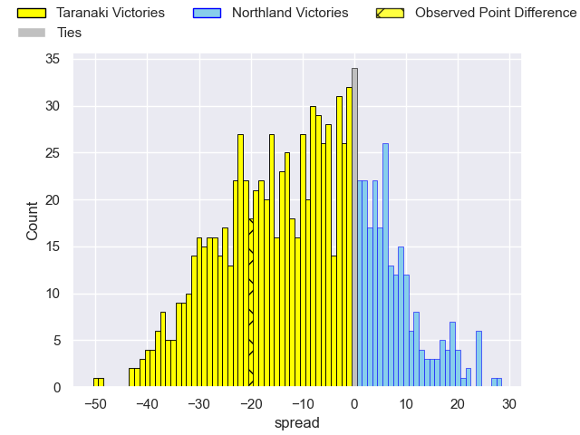
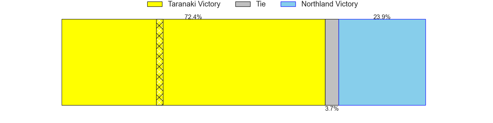

---  
layout: page  
title: Taranaki V Northland on 2025/08/02  
date: 2025-08-02  
categories: "NPC 2025" match projection  
---
# Taranaki V Northland on 2025/08/02, 23.0 to 3.0

# Club Level Predictions

Now that the game has been played, lets see how the club predictions did. I predicted Taranaki to win by 9.85, and Taranaki won by 20.0. That's an absolute error of 10.2 for the margin of victory, while my average absolute error has been 14.2 over the past six months. This prediction was more accurate than 52.0% of my recent predictions.

For the Over/Under model, I predicted a total of 53.5 and we have an actual total of 26.0. That's an absolute error of 27.5 compared to a six month average of 14.0. This prediction was more accurate than 11.6% of my recent predictions.
## Projected Performances - Club Model

## Projected Spreads - Club Model

## Projected Results - Club Model

