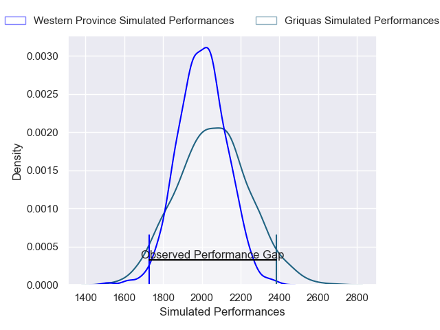
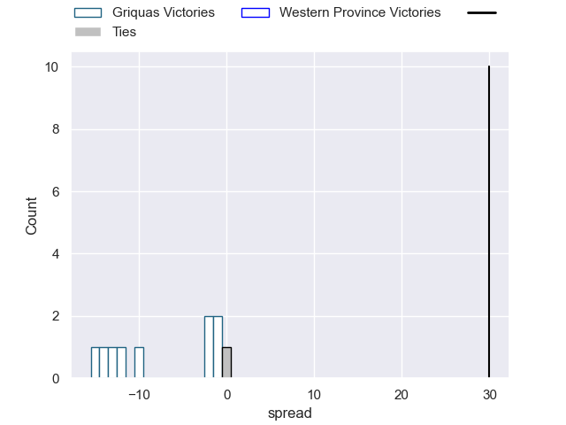

---  
layout: page  
title: Griquas V Western Province on 2025/08/08  
date: 2025-08-08  
categories: "Currie Cup 2025" match projection  
---
# Griquas V Western Province on 2025/08/08, 47.0 to 17.0

# Club Level Predictions

Now that the game has been played, lets see how the club predictions did. I predicted Griquas to win by 1.87, and Griquas won by 30.0. That's an absolute error of 28.1 for the margin of victory, while my average absolute error has been 14.2 over the past six months. This prediction was more accurate than 11.5% of my recent predictions.

For the Over/Under model, I predicted a total of 62.5 and we have an actual total of 64.0. That's an absolute error of 1.5 compared to a six month average of 14.1. This prediction was more accurate than 93.3% of my recent predictions.
## Projected Performances - Club Model

## Projected Spreads - Club Model

## Projected Results - Club Model

