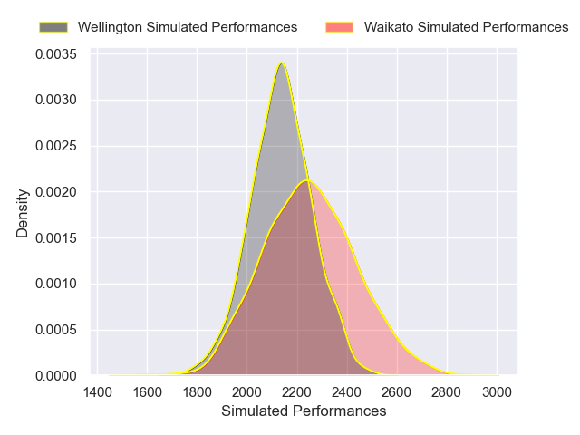
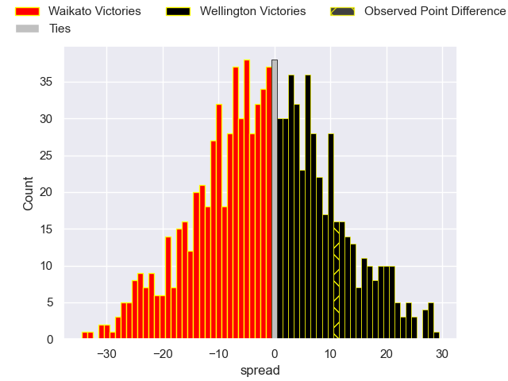

---  
layout: page  
title: Waikato V Wellington on 2025/08/08  
date: 2025-08-08  
categories: "NPC 2025" match projection  
---
# Waikato V Wellington on 2025/08/08, 24.0 to 35.0

# Club Level Predictions

Now that the game has been played, lets see how the club predictions did. I predicted Waikato to win by 1.34, and Wellington won by 11.0. That's an absolute error of 12.3 for the margin of victory, while my average absolute error has been 14.2 over the past six months. This prediction was more accurate than 44.5% of my recent predictions.

For the Over/Under model, I predicted a total of 54.5 and we have an actual total of 59.0. That's an absolute error of 4.5 compared to a six month average of 14.1. This prediction was more accurate than 80.8% of my recent predictions.
## Projected Performances - Club Model

## Projected Spreads - Club Model

## Projected Results - Club Model

