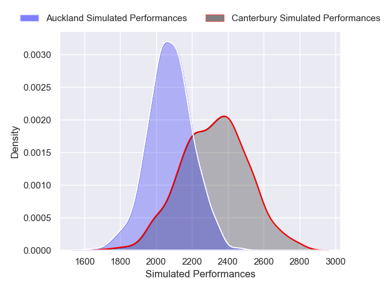
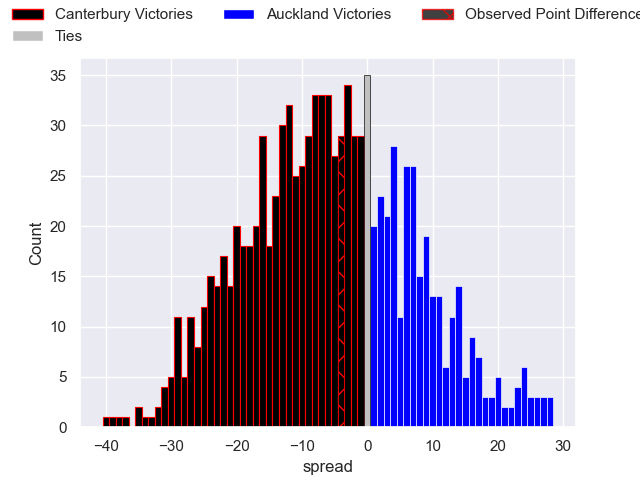

---  
layout: page  
title: Canterbury V Auckland on 2025/08/09  
date: 2025-08-09  
categories: "NPC 2025" match projection  
---
# Canterbury V Auckland on 2025/08/09, 19.0 to 15.0

# Club Level Predictions

Now that the game has been played, lets see how the club predictions did. I predicted Canterbury to win by 3.0, and Canterbury won by 4.0. That's an absolute error of 1.0 for the margin of victory, while my average absolute error has been 14.2 over the past six months. This prediction was more accurate than 95.3% of my recent predictions.

For the Over/Under model, I predicted a total of 52.5 and we have an actual total of 34.0. That's an absolute error of 18.5 compared to a six month average of 14.1. This prediction was more accurate than 28.4% of my recent predictions.
## Projected Performances - Club Model

## Projected Spreads - Club Model

## Projected Results - Club Model

