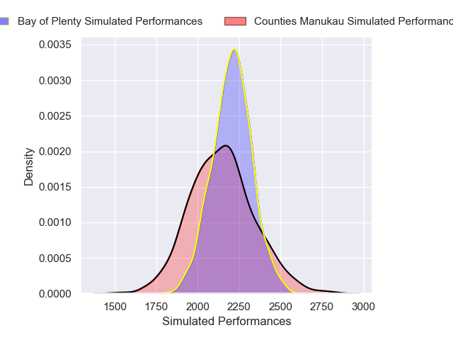
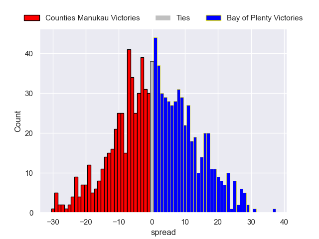

---  
layout: page  
title: Counties Manukau V Bay of Plenty on 2025/08/09  
date: 2025-08-09  
categories: "NPC 2025" match projection  
---
# Counties Manukau V Bay of Plenty on 2025/08/09, 22.0 to 39.0

# Club Level Predictions

Now that the game has been played, lets see how the club predictions did. I predicted Counties Manukau to win by 1.68, and Bay of Plenty won by 17.0. That's an absolute error of 18.7 for the margin of victory, while my average absolute error has been 14.2 over the past six months. This prediction was more accurate than 27.1% of my recent predictions.

For the Over/Under model, I predicted a total of 53.5 and we have an actual total of 61.0. That's an absolute error of 7.5 compared to a six month average of 14.1. This prediction was more accurate than 65.7% of my recent predictions.
## Projected Performances - Club Model

## Projected Spreads - Club Model

## Projected Results - Club Model

