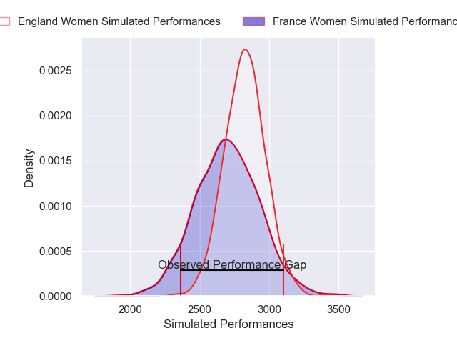
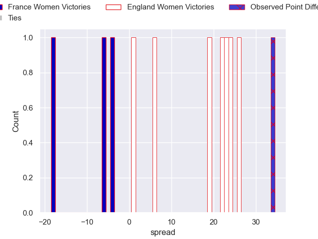
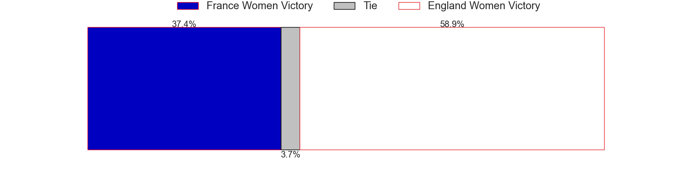

---  
layout: page  
title: France Women V England Women on 2025/08/09  
date: 2025-08-09  
categories: "Women's International Test Match 2025" match projection  
---
# France Women V England Women on 2025/08/09, 6.0 to 40.0

# Club Level Predictions

Now that the game has been played, lets see how the club predictions did. I predicted England Women to win by 9.3, and England Women won by 34.0. That's an absolute error of 24.7 for the margin of victory, while my average absolute error has been 14.2 over the past six months. This prediction was more accurate than 15.8% of my recent predictions.

For the Over/Under model, I predicted a total of 48.5 and we have an actual total of 46.0. That's an absolute error of 2.5 compared to a six month average of 14.1. This prediction was more accurate than 88.6% of my recent predictions.
## Projected Performances - Club Model

## Projected Spreads - Club Model

## Projected Results - Club Model

