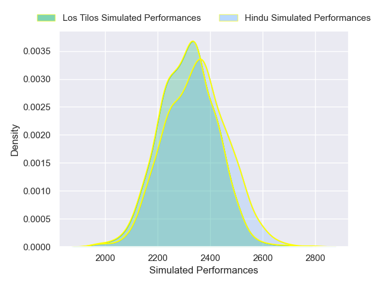
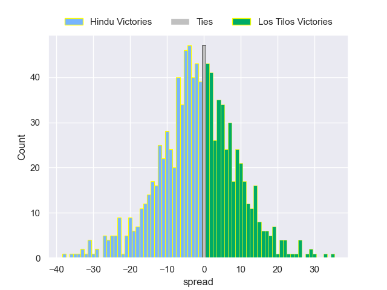

---  
layout: page  
title: Hindu V Los Tilos on 2025/08/09  
date: 2025-08-09  
categories: "URBA Top 13 2025" match projection  
---
# Hindu V Los Tilos on 2025/08/09, 10.0 to 24.0

# Club Level Predictions

Now that the game has been played, lets see how the club predictions did. I predicted Hindu to win by 5.4, and Los Tilos won by 14.0. That's an absolute error of 19.4 for the margin of victory, while my average absolute error has been 14.2 over the past six months. This prediction was more accurate than 25.2% of my recent predictions.

For the Over/Under model, I predicted a total of 48.5 and we have an actual total of 34.0. That's an absolute error of 14.5 compared to a six month average of 14.1. This prediction was more accurate than 40.7% of my recent predictions.
## Projected Performances - Club Model

## Projected Spreads - Club Model

## Projected Results - Club Model

