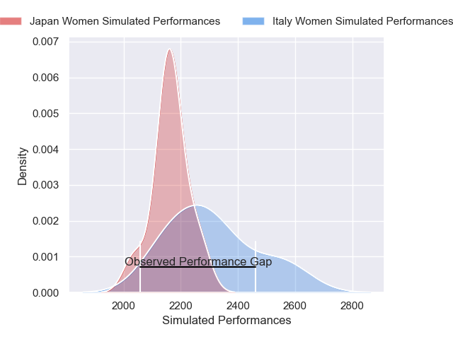
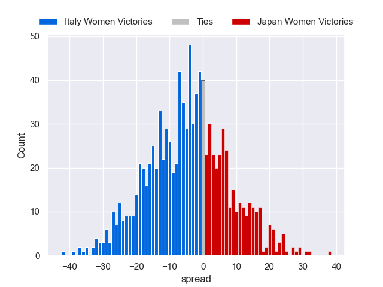

---  
layout: page  
title: Italy Women V Japan Women on 2025/08/09  
date: 2025-08-09  
categories: "Women's International Test Match 2025" match projection  
---
# Italy Women V Japan Women on 2025/08/09, 33.0 to 15.0

# Club Level Predictions

Now that the game has been played, lets see how the club predictions did. I predicted Italy Women to win by 4.7, and Italy Women won by 18.0. That's an absolute error of 13.3 for the margin of victory, while my average absolute error has been 14.2 over the past six months. This prediction was more accurate than 41.1% of my recent predictions.

For the Over/Under model, I predicted a total of 53.5 and we have an actual total of 48.0. That's an absolute error of 5.5 compared to a six month average of 14.1. This prediction was more accurate than 75.7% of my recent predictions.
## Projected Performances - Club Model

## Projected Spreads - Club Model

## Projected Results - Club Model

