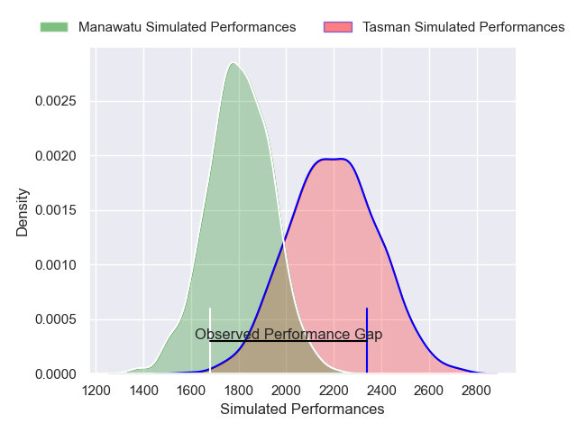
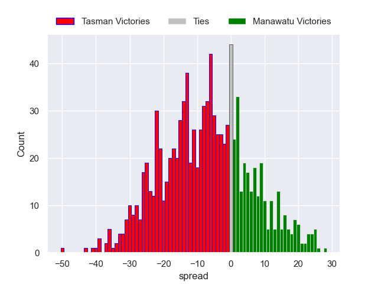

---  
layout: page  
title: Tasman V Manawatu on 2025/08/09  
date: 2025-08-09  
categories: "NPC 2025" match projection  
---
# Tasman V Manawatu on 2025/08/09, 49.0 to 17.0

# Club Level Predictions

Now that the game has been played, lets see how the club predictions did. I predicted Tasman to win by 11.1, and Tasman won by 32.0. That's an absolute error of 20.9 for the margin of victory, while my average absolute error has been 14.2 over the past six months. This prediction was more accurate than 21.8% of my recent predictions.

For the Over/Under model, I predicted a total of 65.5 and we have an actual total of 66.0. That's an absolute error of 0.5 compared to a six month average of 14.1. This prediction was more accurate than 98.0% of my recent predictions.
## Projected Performances - Club Model

## Projected Spreads - Club Model

## Projected Results - Club Model

