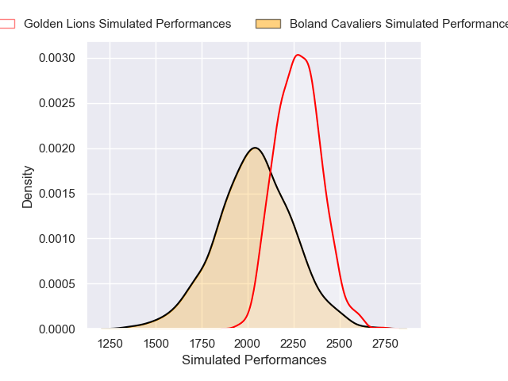
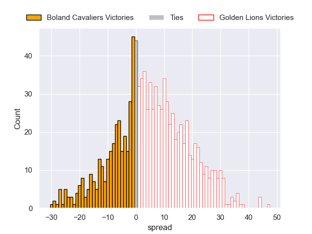

---  
layout: page  
title: Boland Cavaliers V Golden Lions on 2025/08/10  
date: 2025-08-10  
categories: "Currie Cup 2025" match projection  
---
# Boland Cavaliers V Golden Lions on 2025/08/10, 29.0 to 10.0

# Club Level Predictions

Now that the game has been played, lets see how the club predictions did. I predicted Golden Lions to win by 6.56, and Boland Cavaliers won by 19.0. That's an absolute error of 25.6 for the margin of victory, while my average absolute error has been 14.2 over the past six months. This prediction was more accurate than 14.6% of my recent predictions.

For the Over/Under model, I predicted a total of 61.5 and we have an actual total of 39.0. That's an absolute error of 22.5 compared to a six month average of 14.1. This prediction was more accurate than 19.7% of my recent predictions.
## Projected Performances - Club Model

## Projected Spreads - Club Model

## Projected Results - Club Model

