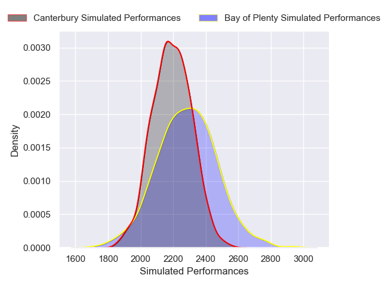
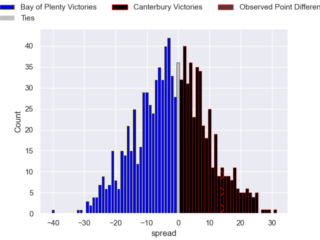

---  
layout: page  
title: Bay of Plenty V Canterbury on 2025/08/15  
date: 2025-08-15  
categories: "NPC 2025" match projection  
---
# Bay of Plenty V Canterbury on 2025/08/15, 7.0 to 21.0

# Club Level Predictions

Now that the game has been played, lets see how the club predictions did. I predicted Bay of Plenty to win by 3.02, and Canterbury won by 14.0. That's an absolute error of 17.0 for the margin of victory, while my average absolute error has been 14.2 over the past six months. This prediction was more accurate than 30.5% of my recent predictions.

For the Over/Under model, I predicted a total of 52.5 and we have an actual total of 28.0. That's an absolute error of 24.5 compared to a six month average of 13.9. This prediction was more accurate than 15.7% of my recent predictions.
## Projected Performances - Club Model

## Projected Spreads - Club Model

## Projected Results - Club Model

