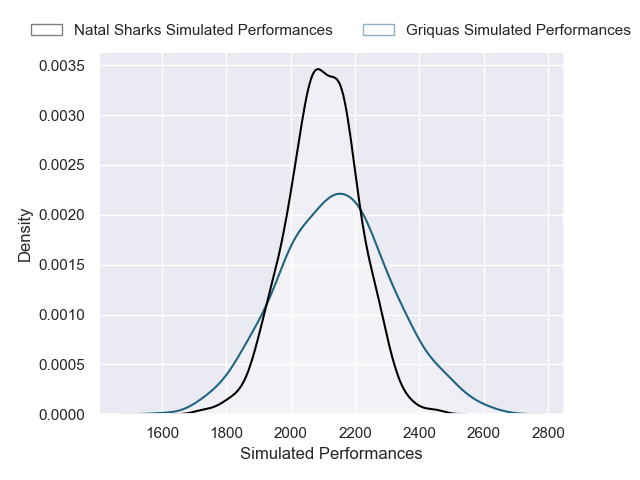
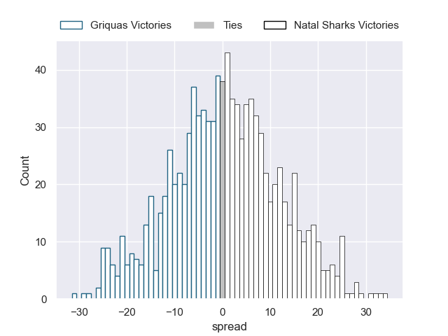
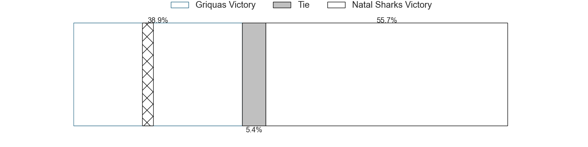

---  
layout: page  
title: Griquas V Natal Sharks on 2025/08/15  
date: 2025-08-15  
categories: "Currie Cup 2025" match projection  
---
# Griquas V Natal Sharks on 2025/08/15, 26.0 to 17.0

# Club Level Predictions

Now that the game has been played, lets see how the club predictions did. I predicted Natal Sharks to win by 2.17, and Griquas won by 9.0. That's an absolute error of 11.2 for the margin of victory, while my average absolute error has been 14.2 over the past six months. This prediction was more accurate than 48.2% of my recent predictions.

For the Over/Under model, I predicted a total of 57.5 and we have an actual total of 43.0. That's an absolute error of 14.5 compared to a six month average of 14.0. This prediction was more accurate than 38.9% of my recent predictions.
## Projected Performances - Club Model

## Projected Spreads - Club Model

## Projected Results - Club Model

