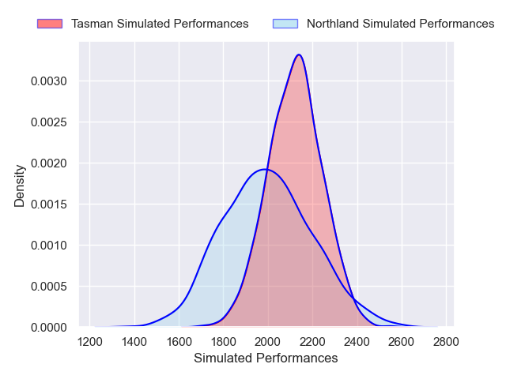
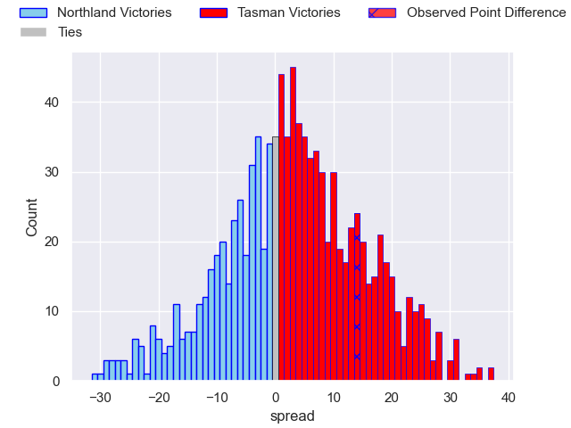

---  
layout: page  
title: Northland V Tasman on 2025/08/15  
date: 2025-08-15  
categories: "NPC 2025" match projection  
---
# Northland V Tasman on 2025/08/15, 14.0 to 28.0

# Club Level Predictions

Now that the game has been played, lets see how the club predictions did. I predicted Tasman to win by 2.81, and Tasman won by 14.0. That's an absolute error of 11.2 for the margin of victory, while my average absolute error has been 14.2 over the past six months. This prediction was more accurate than 48.0% of my recent predictions.

For the Over/Under model, I predicted a total of 54.5 and we have an actual total of 42.0. That's an absolute error of 12.5 compared to a six month average of 14.0. This prediction was more accurate than 45.9% of my recent predictions.
## Projected Performances - Club Model

## Projected Spreads - Club Model

## Projected Results - Club Model

