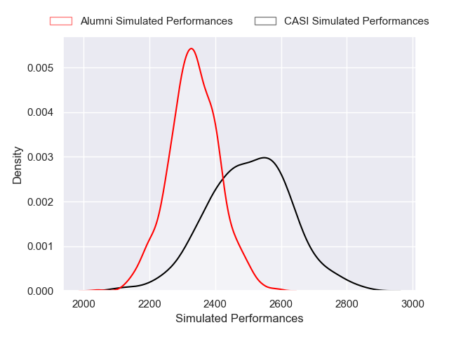
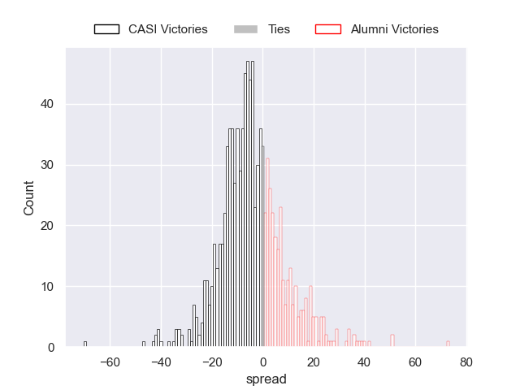
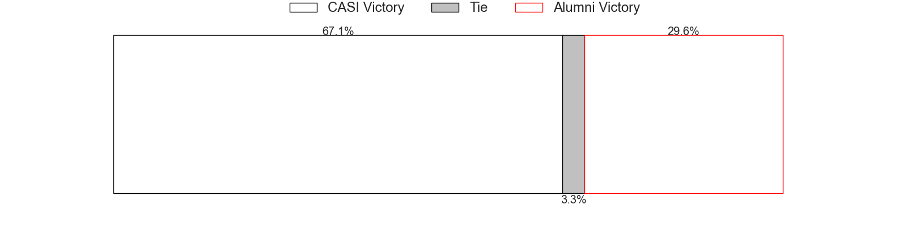

---  
layout: page  
title: CASI V Alumni on 2025/08/16  
date: 2025-08-16  
categories: "URBA Top 13 2025" match projection  
---
# CASI V Alumni on 2025/08/16, 31.0 to 20.0

# Club Level Predictions

Now that the game has been played, lets see how the club predictions did. I predicted CASI to win by 5.89, and CASI won by 11.0. That's an absolute error of 5.1 for the margin of victory, while my average absolute error has been 14.2 over the past six months. This prediction was more accurate than 74.5% of my recent predictions.

For the Over/Under model, I predicted a total of 51.5 and we have an actual total of 51.0. That's an absolute error of 0.5 compared to a six month average of 13.9. This prediction was more accurate than 97.3% of my recent predictions.
## Projected Performances - Club Model

## Projected Spreads - Club Model

## Projected Results - Club Model

