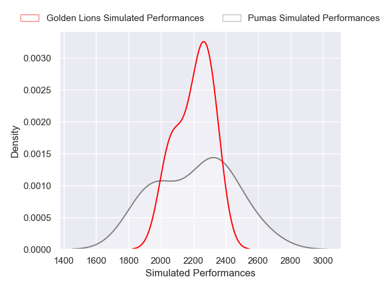
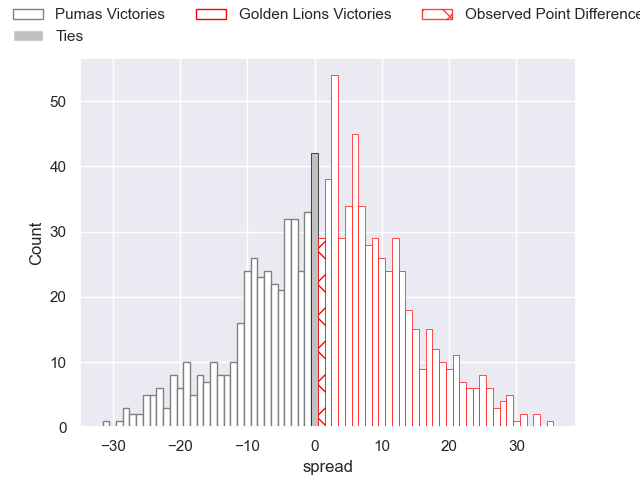

---  
layout: page  
title: Pumas V Golden Lions on 2025/08/16  
date: 2025-08-16  
categories: "Currie Cup 2025" match projection  
---
# Pumas V Golden Lions on 2025/08/16, 35.0 to 36.0

# Club Level Predictions

Now that the game has been played, lets see how the club predictions did. I predicted Golden Lions to win by 2.45, and Golden Lions won by 1.0. That's an absolute error of 1.5 for the margin of victory, while my average absolute error has been 14.2 over the past six months. This prediction was more accurate than 92.2% of my recent predictions.

For the Over/Under model, I predicted a total of 56.5 and we have an actual total of 71.0. That's an absolute error of 14.5 compared to a six month average of 14.0. This prediction was more accurate than 38.9% of my recent predictions.
## Projected Performances - Club Model

## Projected Spreads - Club Model

## Projected Results - Club Model

