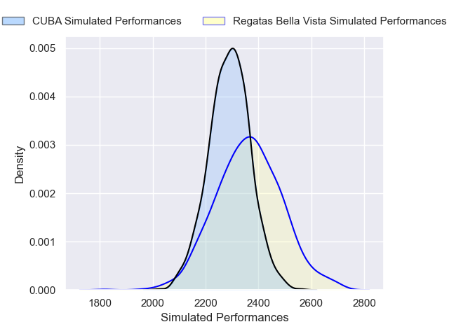
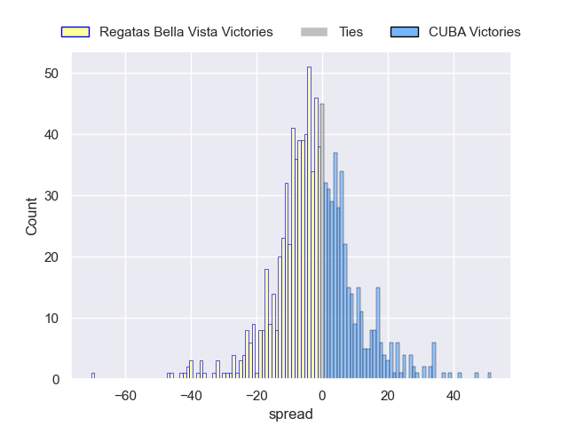

---  
layout: page  
title: Regatas Bella Vista V CUBA on 2025/08/16  
date: 2025-08-16  
categories: "URBA Top 13 2025" match projection  
---
# Regatas Bella Vista V CUBA on 2025/08/16, 25.0 to 22.0

# Club Level Predictions

Now that the game has been played, lets see how the club predictions did. I predicted Regatas Bella Vista to win by 1.9, and Regatas Bella Vista won by 3.0. That's an absolute error of 1.1 for the margin of victory, while my average absolute error has been 14.2 over the past six months. This prediction was more accurate than 94.5% of my recent predictions.

For the Over/Under model, I predicted a total of 51.5 and we have an actual total of 47.0. That's an absolute error of 4.5 compared to a six month average of 13.9. This prediction was more accurate than 79.9% of my recent predictions.
## Projected Performances - Club Model

## Projected Spreads - Club Model

## Projected Results - Club Model

