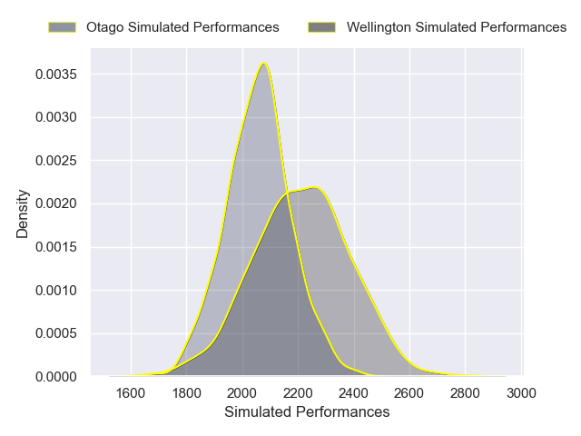

---  
layout: page  
title: Wellington V Otago on 2025/08/16  
date: 2025-08-16  
categories: "NPC 2025" match projection  
---
# Wellington V Otago on 2025/08/16, 41.0 to 46.0

# Club Level Predictions

Now that the game has been played, lets see how the club predictions did. I predicted Wellington to win by 6.29, and Otago won by 5.0. That's an absolute error of 11.3 for the margin of victory, while my average absolute error has been 14.2 over the past six months. This prediction was more accurate than 47.6% of my recent predictions.

For the Over/Under model, I predicted a total of 50.5 and we have an actual total of 87.0. That's an absolute error of 36.5 compared to a six month average of 14.0. This prediction was more accurate than 4.2% of my recent predictions.
## Projected Performances - Club Model

## Projected Spreads - Club Model

## Projected Results - Club Model

