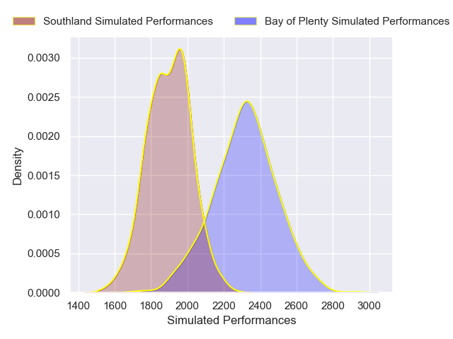
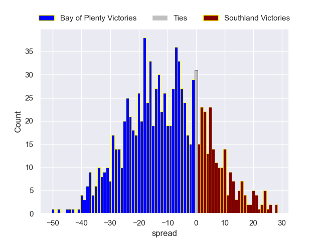

---  
layout: page  
title: Bay of Plenty V Southland on 2025/08/21  
date: 2025-08-21  
categories: "NPC 2025" match projection  
---
# Bay of Plenty V Southland on 2025/08/21, 25.0 to 30.0

# Club Level Predictions

Now that the game has been played, lets see how the club predictions did. I predicted Bay of Plenty to win by 9.25, and Southland won by 5.0. That's an absolute error of 14.2 for the margin of victory, while my average absolute error has been 14.5 over the past six months. This prediction was more accurate than 38.3% of my recent predictions.

For the Over/Under model, I predicted a total of 51.5 and we have an actual total of 55.0. That's an absolute error of 3.5 compared to a six month average of 13.9. This prediction was more accurate than 83.3% of my recent predictions.
## Projected Performances - Club Model

## Projected Spreads - Club Model

## Projected Results - Club Model

