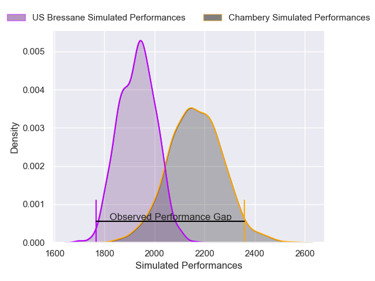
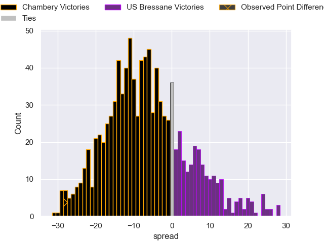

---  
layout: page  
title: Chambery V US Bressane on 2025/08/22  
date: 2025-08-22  
categories: "Nationale 25/26" match projection  
---
# Chambery V US Bressane on 2025/08/22, 48.0 to 20.0

# Club Level Predictions

Now that the game has been played, lets see how the club predictions did. I predicted Chambery to win by 6.58, and Chambery won by 28.0. That's an absolute error of 21.4 for the margin of victory, while my average absolute error has been 14.3 over the past six months. This prediction was more accurate than 21.4% of my recent predictions.

For the Over/Under model, I predicted a total of 48.5 and we have an actual total of 68.0. That's an absolute error of 19.5 compared to a six month average of 13.7. This prediction was more accurate than 25.2% of my recent predictions.
## Projected Performances - Club Model

## Projected Spreads - Club Model

## Projected Results - Club Model

