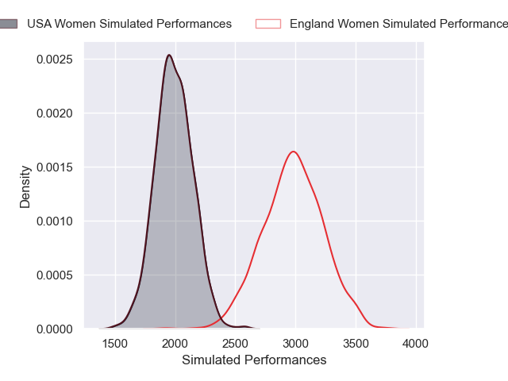
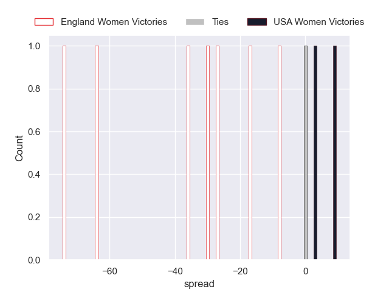

---  
layout: page  
title: England Women V USA Women on 2025/08/22  
date: 2025-08-22  
categories: "Women's Rugby World Cup 2025" match projection  
---
# England Women V USA Women on 2025/08/22, 69.0 to 7.0

# Club Level Predictions

Now that the game has been played, lets see how the club predictions did. I predicted England Women to win by 26.38, and England Women won by 62.0. That's an absolute error of 35.6 for the margin of victory, while my average absolute error has been 14.3 over the past six months. This prediction was more accurate than 6.6% of my recent predictions.

For the Over/Under model, I predicted a total of 60.5 and we have an actual total of 76.0. That's an absolute error of 15.5 compared to a six month average of 13.7. This prediction was more accurate than 35.0% of my recent predictions.
## Projected Performances - Club Model

## Projected Spreads - Club Model

## Projected Results - Club Model

