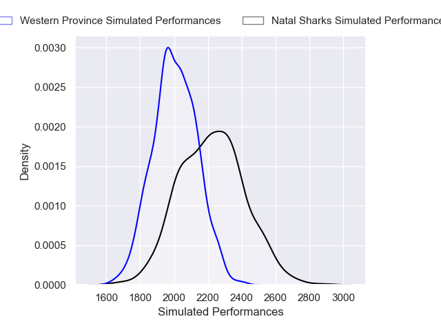
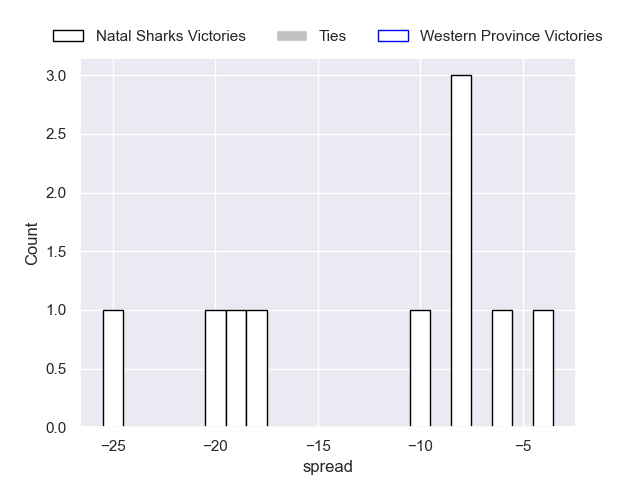

---  
layout: page  
title: Natal Sharks V Western Province on 2025/08/22  
date: 2025-08-22  
categories: "Currie Cup 2025" match projection  
---
# Natal Sharks V Western Province on 2025/08/22, 5.0 to 14.0

# Club Level Predictions

Now that the game has been played, lets see how the club predictions did. I predicted Natal Sharks to win by 5.94, and Western Province won by 9.0. That's an absolute error of 14.9 for the margin of victory, while my average absolute error has been 14.2 over the past six months. This prediction was more accurate than 36.0% of my recent predictions.

For the Over/Under model, I predicted a total of 52.5 and we have an actual total of 19.0. That's an absolute error of 33.5 compared to a six month average of 13.9. This prediction was more accurate than 5.6% of my recent predictions.
## Projected Performances - Club Model

## Projected Spreads - Club Model

## Projected Results - Club Model

