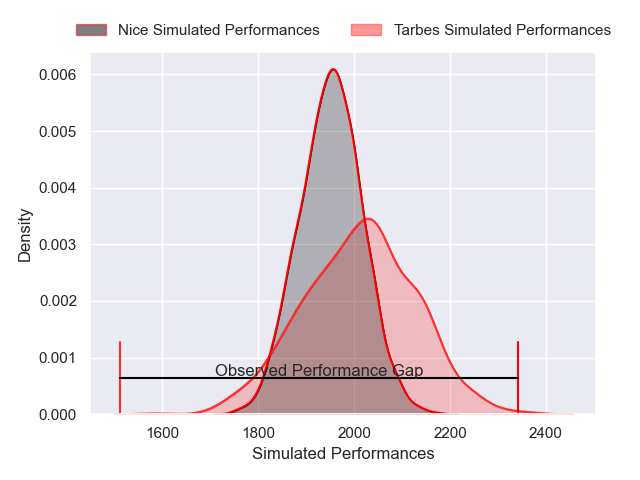
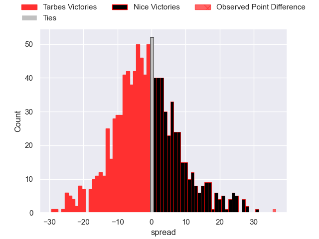

---  
layout: page  
title: Tarbes V Nice on 2025/08/22  
date: 2025-08-22  
categories: "Nationale 25/26" match projection  
---
# Tarbes V Nice on 2025/08/22, 6.0 to 42.0

# Club Level Predictions

Now that the game has been played, lets see how the club predictions did. I predicted Tarbes to win by 1.44, and Nice won by 36.0. That's an absolute error of 37.4 for the margin of victory, while my average absolute error has been 14.3 over the past six months. This prediction was more accurate than 6.0% of my recent predictions.

For the Over/Under model, I predicted a total of 48.5 and we have an actual total of 48.0. That's an absolute error of 0.5 compared to a six month average of 13.7. This prediction was more accurate than 97.1% of my recent predictions.
## Projected Performances - Club Model

## Projected Spreads - Club Model

## Projected Results - Club Model

