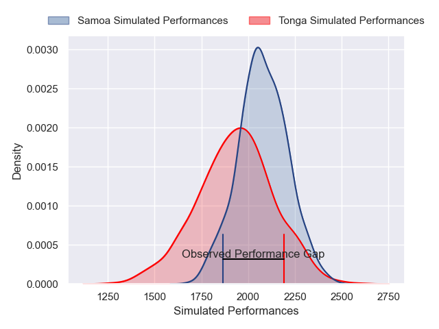
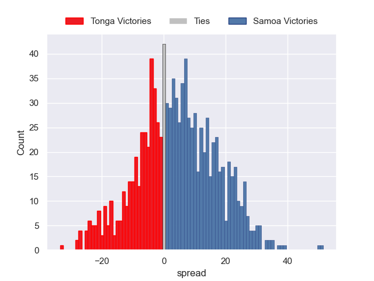

---  
layout: page  
title: Tonga V Samoa on 2025/08/22  
date: 2025-08-22  
categories: "Pacific Nations Cup 2025" match projection  
---
# Tonga V Samoa on 2025/08/22, 30.0 to 16.0

# Club Level Predictions

Now that the game has been played, lets see how the club predictions did. I predicted Samoa to win by 4.25, and Tonga won by 14.0. That's an absolute error of 18.2 for the margin of victory, while my average absolute error has been 14.3 over the past six months. This prediction was more accurate than 28.0% of my recent predictions.

For the Over/Under model, I predicted a total of 49.5 and we have an actual total of 46.0. That's an absolute error of 3.5 compared to a six month average of 13.7. This prediction was more accurate than 83.9% of my recent predictions.
## Projected Performances - Club Model

## Projected Spreads - Club Model

## Projected Results - Club Model

