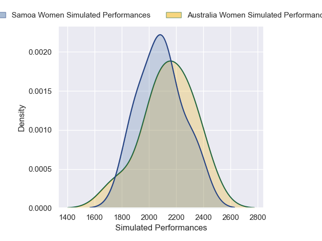
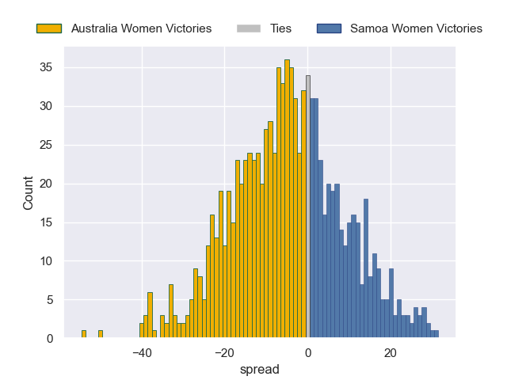

---  
layout: page  
title: Australia Women V Samoa Women on 2025/08/23  
date: 2025-08-23  
categories: "Women's Rugby World Cup 2025" match projection  
---
# Australia Women V Samoa Women on 2025/08/23, 73.0 to 0.0

# Club Level Predictions

Now that the game has been played, lets see how the club predictions did. I predicted Samoa Women to win by 3.04, and Australia Women won by 73.0. That's an absolute error of 76.0 for the margin of victory, while my average absolute error has been 14.5 over the past six months. This prediction was more accurate than 0.7% of my recent predictions.

For the Over/Under model, I predicted a total of 46.5 and we have an actual total of 73.0. That's an absolute error of 26.5 compared to a six month average of 13.9. This prediction was more accurate than 12.9% of my recent predictions.
## Projected Performances - Club Model

## Projected Spreads - Club Model

## Projected Results - Club Model

