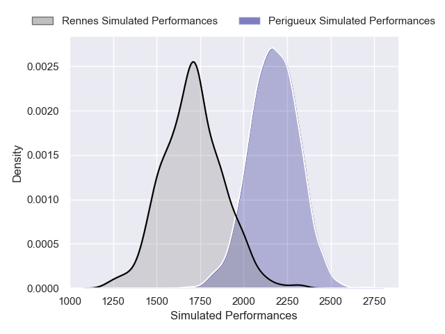
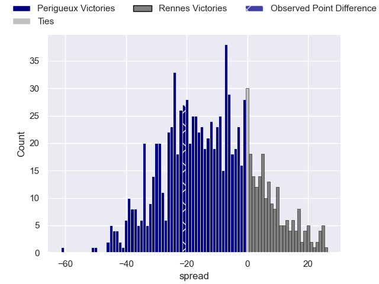

---  
layout: page  
title: Périgueux V Rennes on 2025/08/23  
date: 2025-08-23  
categories: "Nationale 25/26" match projection  
---
# Périgueux V Rennes on 2025/08/23, 42.0 to 21.0

# Club Level Predictions

Now that the game has been played, lets see how the club predictions did. I predicted Perigueux to win by 11.34, and Perigueux won by 21.0. That's an absolute error of 9.7 for the margin of victory, while my average absolute error has been 14.5 over the past six months. This prediction was more accurate than 55.0% of my recent predictions.

For the Over/Under model, I predicted a total of 44.5 and we have an actual total of 63.0. That's an absolute error of 18.5 compared to a six month average of 13.9. This prediction was more accurate than 28.1% of my recent predictions.
## Projected Performances - Club Model

## Projected Spreads - Club Model

## Projected Results - Club Model

