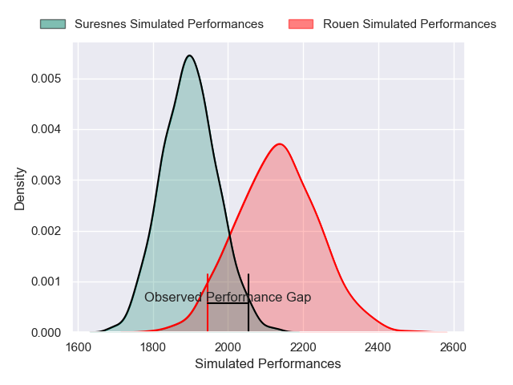
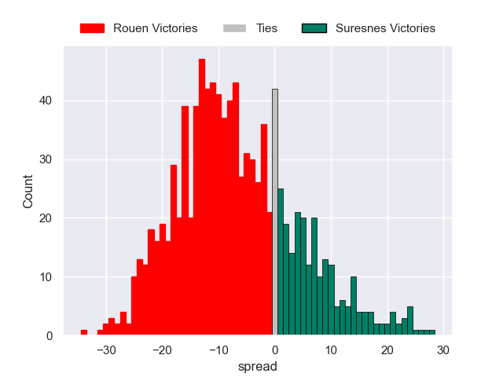

---  
layout: page  
title: Rouen V Suresnes on 2025/08/23  
date: 2025-08-23  
categories: "Nationale 25/26" match projection  
---
# Rouen V Suresnes on 2025/08/23, 13.0 to 17.0

# Club Level Predictions

Now that the game has been played, lets see how the club predictions did. I predicted Rouen to win by 6.87, and Suresnes won by 4.0. That's an absolute error of 10.9 for the margin of victory, while my average absolute error has been 14.3 over the past six months. This prediction was more accurate than 49.5% of my recent predictions.

For the Over/Under model, I predicted a total of 45.5 and we have an actual total of 30.0. That's an absolute error of 15.5 compared to a six month average of 13.7. This prediction was more accurate than 35.0% of my recent predictions.
## Projected Performances - Club Model

## Projected Spreads - Club Model

## Projected Results - Club Model

