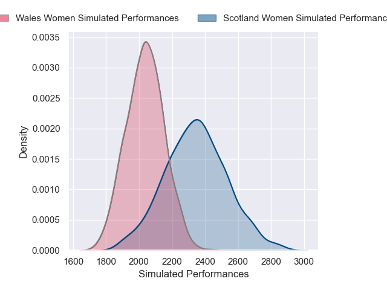
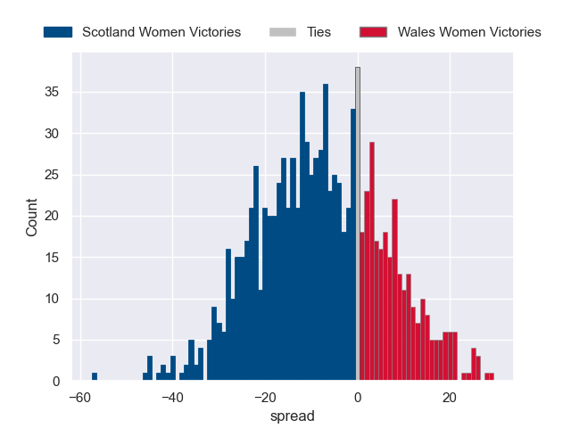

---  
layout: page  
title: Scotland Women V Wales Women on 2025/08/23  
date: 2025-08-23  
categories: "Women's Rugby World Cup 2025" match projection  
---
# Scotland Women V Wales Women on 2025/08/23, 38.0 to 8.0

# Club Level Predictions

Now that the game has been played, lets see how the club predictions did. I predicted Scotland Women to win by 5.96, and Scotland Women won by 30.0. That's an absolute error of 24.0 for the margin of victory, while my average absolute error has been 14.5 over the past six months. This prediction was more accurate than 16.9% of my recent predictions.

For the Over/Under model, I predicted a total of 48.5 and we have an actual total of 46.0. That's an absolute error of 2.5 compared to a six month average of 13.9. This prediction was more accurate than 88.4% of my recent predictions.
## Projected Performances - Club Model

## Projected Spreads - Club Model

## Projected Results - Club Model

