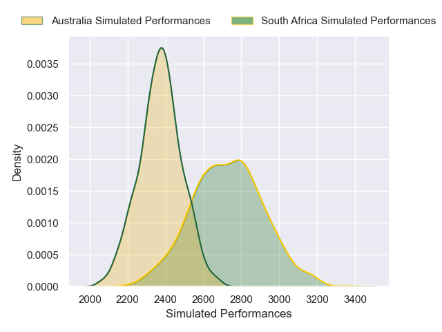
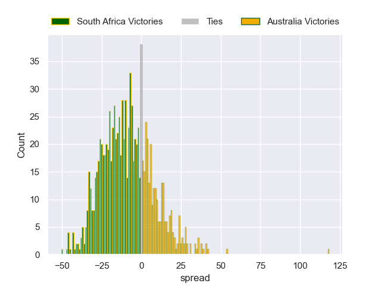

---  
layout: page  
title: South Africa V Australia on 2025/08/23  
date: 2025-08-23  
categories: "Rugby Championship 2025" match projection  
---
# South Africa V Australia on 2025/08/23, 30.0 to 22.0

# Club Level Predictions

Now that the game has been played, lets see how the club predictions did. I predicted South Africa to win by 13.96, and South Africa won by 8.0. That's an absolute error of 6.0 for the margin of victory, while my average absolute error has been 14.5 over the past six months. This prediction was more accurate than 72.4% of my recent predictions.

For the Over/Under model, I predicted a total of 53.5 and we have an actual total of 52.0. That's an absolute error of 1.5 compared to a six month average of 13.9. This prediction was more accurate than 93.6% of my recent predictions.
## Projected Performances - Club Model

## Projected Spreads - Club Model

## Projected Results - Club Model

