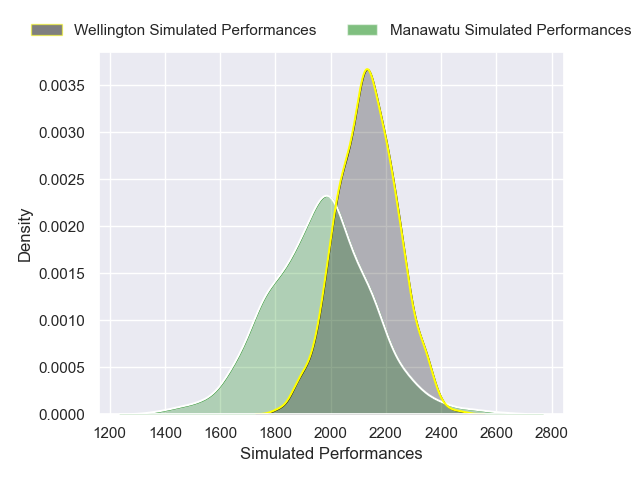
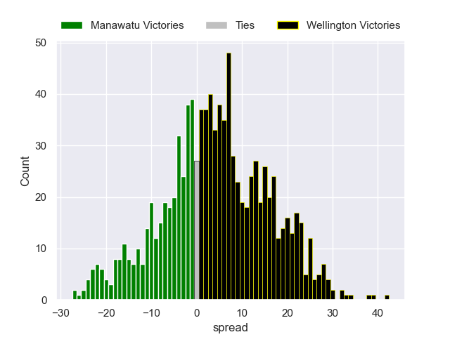

---  
layout: page  
title: Manawatu V Wellington on 2025/08/24  
date: 2025-08-24  
categories: "NPC 2025" match projection  
---
# Manawatu V Wellington on 2025/08/24, 38.0 to 28.0

# Club Level Predictions

Now that the game has been played, lets see how the club predictions did. I predicted Wellington to win by 9.15, and Manawatu won by 10.0. That's an absolute error of 19.2 for the margin of victory, while my average absolute error has been 14.5 over the past six months. This prediction was more accurate than 26.2% of my recent predictions.

For the Over/Under model, I predicted a total of 70.5 and we have an actual total of 66.0. That's an absolute error of 4.5 compared to a six month average of 13.9. This prediction was more accurate than 79.5% of my recent predictions.
## Projected Performances - Club Model

## Projected Spreads - Club Model

## Projected Results - Club Model

