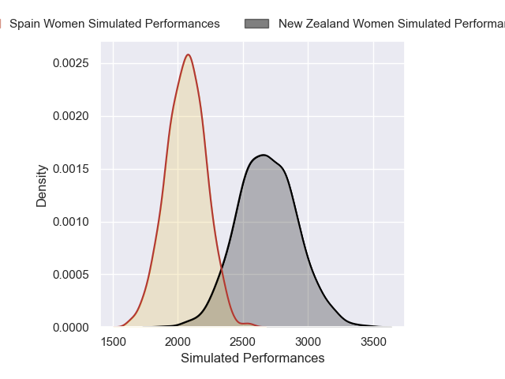
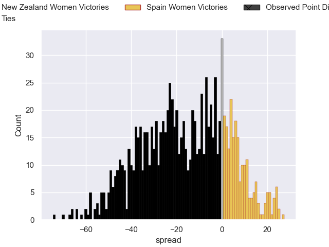
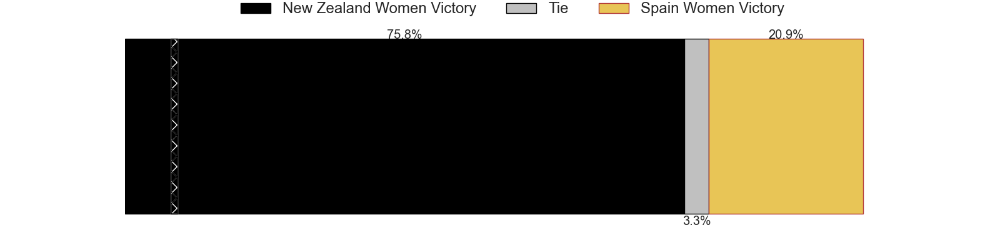

---  
layout: page  
title: New Zealand Women V Spain Women on 2025/08/24  
date: 2025-08-24  
categories: "Women's Rugby World Cup 2025" match projection  
---
# New Zealand Women V Spain Women on 2025/08/24, 54.0 to 8.0

# Club Level Predictions

Now that the game has been played, lets see how the club predictions did. I predicted New Zealand Women to win by 16.14, and New Zealand Women won by 46.0. That's an absolute error of 29.9 for the margin of victory, while my average absolute error has been 14.3 over the past six months. This prediction was more accurate than 9.9% of my recent predictions.

For the Over/Under model, I predicted a total of 61.5 and we have an actual total of 62.0. That's an absolute error of 0.5 compared to a six month average of 13.7. This prediction was more accurate than 97.1% of my recent predictions.
## Projected Performances - Club Model

## Projected Spreads - Club Model

## Projected Results - Club Model

