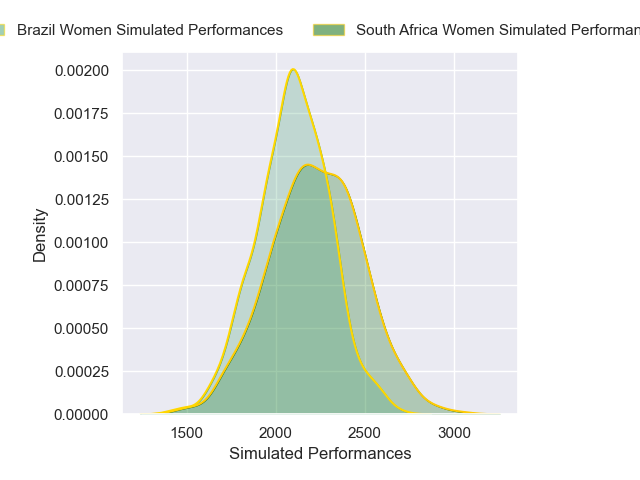
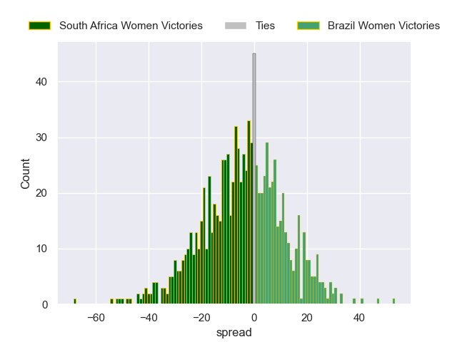

---  
layout: page  
title: South Africa Women V Brazil Women on 2025/08/24  
date: 2025-08-24  
categories: "Women's Rugby World Cup 2025" match projection  
---
# South Africa Women V Brazil Women on 2025/08/24, 66.0 to 6.0

# Club Level Predictions

Now that the game has been played, lets see how the club predictions did. I predicted South Africa Women to win by 2.69, and South Africa Women won by 60.0. That's an absolute error of 57.3 for the margin of victory, while my average absolute error has been 14.3 over the past six months. This prediction was more accurate than 1.4% of my recent predictions.

For the Over/Under model, I predicted a total of 45.5 and we have an actual total of 72.0. That's an absolute error of 26.5 compared to a six month average of 13.7. This prediction was more accurate than 12.7% of my recent predictions.
## Projected Performances - Club Model

## Projected Spreads - Club Model

## Projected Results - Club Model

