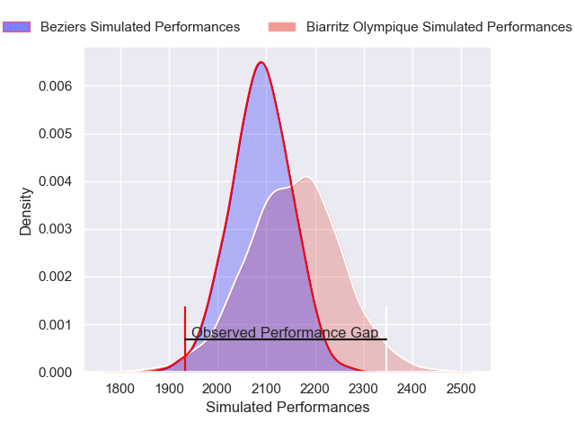
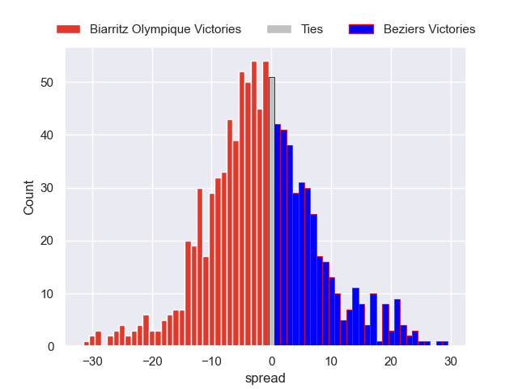

---  
layout: page  
title: Biarritz Olympique V Beziers on 2025/08/29  
date: 2025-08-29  
categories: "Pro D2 25/26" match projection  
---
# Biarritz Olympique V Beziers on 2025/08/29, 55.0 to 36.0

# Club Level Predictions

Now that the game has been played, lets see how the club predictions did. I predicted Biarritz Olympique to win by 2.33, and Biarritz Olympique won by 19.0. That's an absolute error of 16.7 for the margin of victory, while my average absolute error has been 14.6 over the past six months. This prediction was more accurate than 32.1% of my recent predictions.

For the Over/Under model, I predicted a total of 51.5 and we have an actual total of 91.0. That's an absolute error of 39.5 compared to a six month average of 14.0. This prediction was more accurate than 3.6% of my recent predictions.
## Projected Performances - Club Model

## Projected Spreads - Club Model

## Projected Results - Club Model

