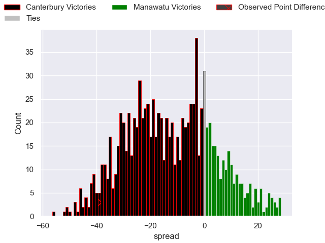

---  
layout: page  
title: Canterbury V Manawatu on 2025/08/29  
date: 2025-08-29  
categories: "NPC 2025" match projection  
---
# Canterbury V Manawatu on 2025/08/29, 53.0 to 14.0

# Club Level Predictions

Now that the game has been played, lets see how the club predictions did. I predicted Canterbury to win by 12.48, and Canterbury won by 39.0. That's an absolute error of 26.5 for the margin of victory, while my average absolute error has been 14.5 over the past six months. This prediction was more accurate than 14.1% of my recent predictions.

For the Over/Under model, I predicted a total of 59.5 and we have an actual total of 67.0. That's an absolute error of 7.5 compared to a six month average of 13.8. This prediction was more accurate than 65.7% of my recent predictions.
## Projected Performances - Club Model

## Projected Spreads - Club Model

## Projected Results - Club Model

