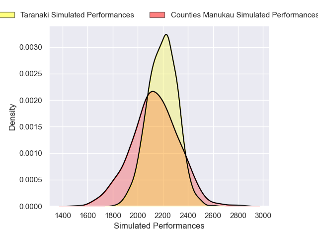
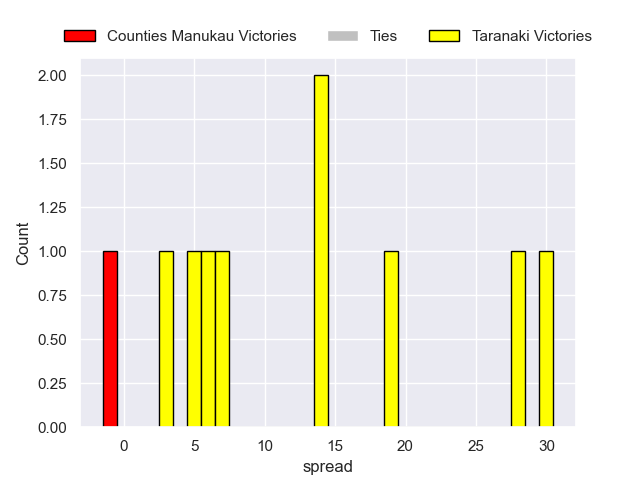

---  
layout: page  
title: Counties Manukau V Taranaki on 2025/08/29  
date: 2025-08-29  
categories: "NPC 2025" match projection  
---
# Counties Manukau V Taranaki on 2025/08/29, 22.0 to 43.0

# Club Level Predictions

Now that the game has been played, lets see how the club predictions did. I predicted Counties Manukau to win by 0.23, and Taranaki won by 21.0. That's an absolute error of 21.2 for the margin of victory, while my average absolute error has been 14.6 over the past six months. This prediction was more accurate than 21.9% of my recent predictions.

For the Over/Under model, I predicted a total of 53.5 and we have an actual total of 65.0. That's an absolute error of 11.5 compared to a six month average of 14.0. This prediction was more accurate than 49.3% of my recent predictions.
## Projected Performances - Club Model

## Projected Spreads - Club Model

## Projected Results - Club Model

