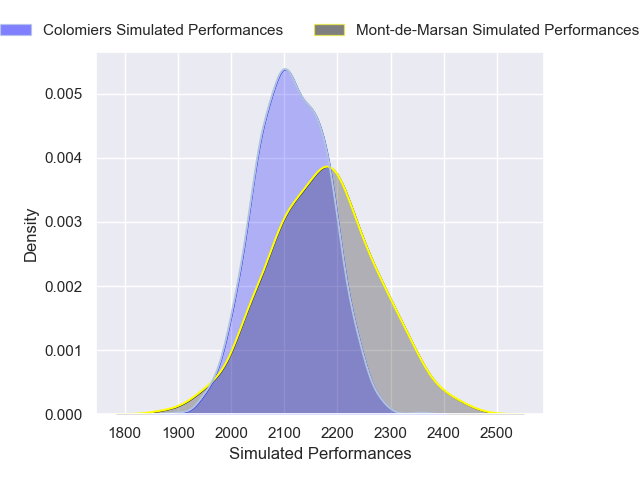
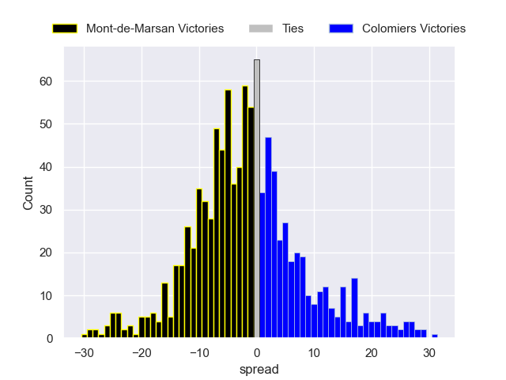

---  
layout: page  
title: Mont-de-Marsan V Colomiers on 2025/08/29  
date: 2025-08-29  
categories: "Pro D2 25/26" match projection  
---
# Mont-de-Marsan V Colomiers on 2025/08/29, 10.0 to 6.0

# Club Level Predictions

Now that the game has been played, lets see how the club predictions did. I predicted Mont-de-Marsan to win by 2.28, and Mont-de-Marsan won by 4.0. That's an absolute error of 1.7 for the margin of victory, while my average absolute error has been 14.5 over the past six months. This prediction was more accurate than 91.2% of my recent predictions.

For the Over/Under model, I predicted a total of 50.5 and we have an actual total of 16.0. That's an absolute error of 34.5 compared to a six month average of 13.9. This prediction was more accurate than 5.1% of my recent predictions.
## Projected Performances - Club Model

## Projected Spreads - Club Model

## Projected Results - Club Model

