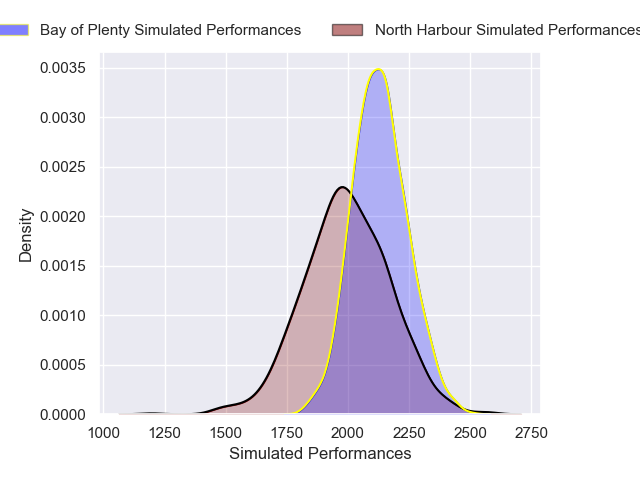
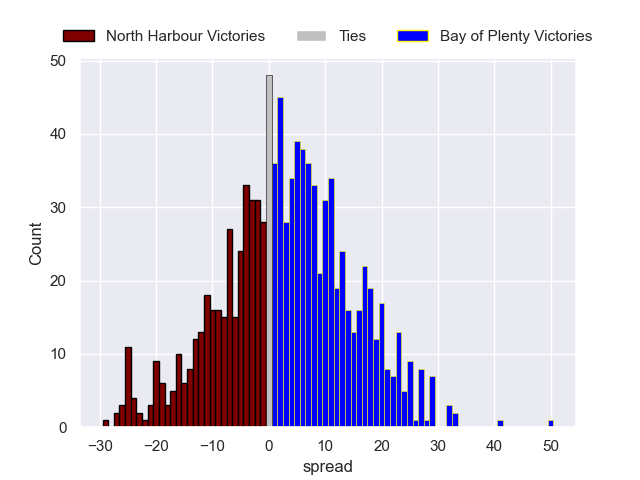
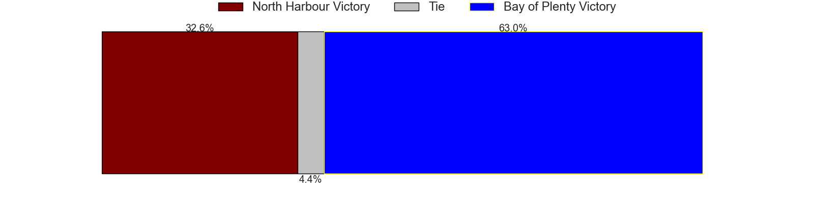

---  
layout: page  
title: North Harbour V Bay of Plenty on 2025/08/29  
date: 2025-08-29  
categories: "NPC 2025" match projection  
---
# North Harbour V Bay of Plenty on 2025/08/29, 7.0 to 19.0

# Club Level Predictions

Now that the game has been played, lets see how the club predictions did. I predicted Bay of Plenty to win by 1.86, and Bay of Plenty won by 12.0. That's an absolute error of 10.1 for the margin of victory, while my average absolute error has been 14.5 over the past six months. This prediction was more accurate than 52.5% of my recent predictions.

For the Over/Under model, I predicted a total of 55.5 and we have an actual total of 26.0. That's an absolute error of 29.5 compared to a six month average of 13.8. This prediction was more accurate than 9.4% of my recent predictions.
## Projected Performances - Club Model

## Projected Spreads - Club Model

## Projected Results - Club Model

